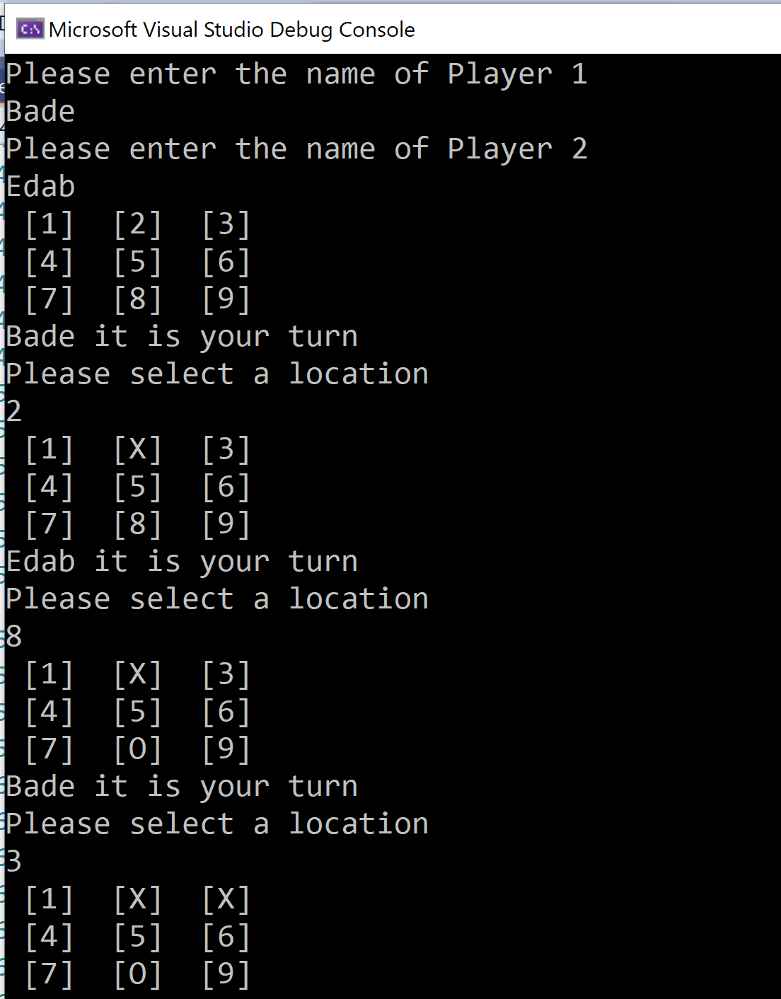

# lab04-tictactoe
Code Fellows 401: Lab 04.

## Tic Tac Toe

Lab04 - Classes & Objects

Authors: Bade Habib, Diane Stephani, Paul Rest

----

## Description
This is a C# console application to practically apply concepts of class 04: classes & objects. This lab consists of a 2-player tic-tac-toe game.

---

### Getting Started
Clone this repository to your local machine.

```
$ git clone [https://github.com/dianestephani/lab04tictactoe.git]
```

### To run the program from Visual Studio:
Select ```File``` -> ```Open``` -> ```Project/Solution```

Next navigate to the location you cloned the Repository.

Double click on the ```Lab 04 Tic Tac Toe Round 2``` directory.

Then select and open ```Lab 04 Tic Tac Toe Round 2.sln```

---

### Visuals

#### Application Start
.png)
#### Using the Application


---

### Change Log
- Program.cs completed.
- Game.cs completed.
- Board.cs completed.
- Summary comments added.
- README updated.


